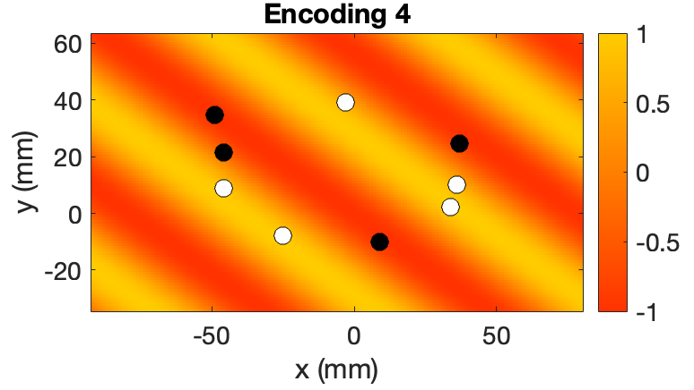

# Optimal Encoding Scheme with Off-resonance Correction for Pseudocontinuous Arterial Spin Labeling

Matlab code for calculating optimal encodings for vessel-encoded or conventional pseudocontinuous arterial spin labelling with or without correction for off-resonance effects, as described in these two papers:

- *Berry ESK, Jezzard P, Okell TW. An Optimized Encoding Scheme for Planning Vessel-Encoded Pseudocontinuous Arterial Spin Labeling. Magnetic Resonance in Medicine. 2015; 74: 1248–1256. [[DOI link](https://doi.org/10.1002/mrm.25508)]*
- *Berry ESK, Jezzard P, Okell TW. Off-resonance correction for pseudo-continuous arterial spin labeling using the optimized encoding scheme. NeuroImage. 2019; 199: 304–312. [[DOI link](https://doi.org/10.1016/j.neuroimage.2019.05.083)]*

## Brief explanation
Pseudocontinuous arterial spin labeling (PCASL) is a non-invasive MRI method to generate perfusion images or angiograms. In vessel-encoded PCASL (or VEPCASL), the labeling efficiency is modulated in a single direction across space using transverse gradient blips and RF phase modulation, such that arteries at some locations are placed in the "label" condition, and arteries at other locations are placed in the "control" condition, with arteries in between being partially labeled. After acquiring a number of different encoding cycles, a matrix describing how the blood signal from each artery is modulated can be constructed and (pseudo)inverted to work out how much blood signal originates in each of the different feeding arteries, giving vessel-selective perfusion images or angiograms. 

However, for complicated vessel geometries, it is not clear how to choose these modulation patterns to achieve an optimal encoding, allowing clean separation of arterial signals with high SNR. The optimal encoding scheme (OES) gives an automated way of optimally choosing these encodings (i.e. their direction, spatial frequency and phase). In essence, it represents the vessels on a grid, with a +1 assigned to vessels which we want to place in the control condition and -1 to those in the label condition. The Fourier transform of this representation is taken, weighted and masked, and the maximum point in this space tells us the optimal parameters to best match this desired encoding. An example encoding is given below for nine blood vessels in an arrangement found above the circle of Willis in the brain, with white dots representing vessels to be placed in the control condition and black dots for those to be labelled and the achieved encoding as a color underlay:

This idea can be extended to correct for off-resonance effects. If the additional phase accrued by a vessel between two PCASL pulses is $\psi$, then we can use the OES approach but now represent each vessel as $e^{i[-\psi]}$ for the label condition and $e^{i[\pi-\psi]}$ for the control condition. The OES then calculates the optimal encodings that undo the effects of off-resonance and produce the desired encoding patterns. This works equally well for conventional PCASL or VEPCASL.

## Code structure
The main OES calculation is performed in `OES_offres.m`, which calls a number of other functions in this folder. Some example applications are given in `example_OES_calculations.m`. An SNR comparison of using the OES with off-resonance correction for four vessels with a simulated fieldmap, similar to Fig 2c,e of *Berry et al. Neuroimage 2019*, can be found in `compare_SNR_offres_correction_4vess_sim_fmap.m`.

Note that the calculated encodings rely on simulation of the modulation function. We include an example here (`modmat_lookup.mat`), but functions relevant for other PCASL parameters can be simulated using the Bloch simulation code provided here: https://github.com/tomokell/bloch_sim. 

## External dependencies
Tested using MATLAB 2024b. Some of the scripts may rely on the following toolboxes:
- Statistics and Machine Learning Toolbox
- Curve Fitting Toolbox

## References
The original OES paper is:

- *Berry ESK, Jezzard P, Okell TW. An Optimized Encoding Scheme for Planning Vessel-Encoded Pseudocontinuous Arterial Spin Labeling. Magnetic Resonance in Medicine. 2015; 74: 1248–1256. [[DOI link](https://doi.org/10.1002/mrm.25508)]*

The extension to off-resonance correction was described here:

- *Berry ESK, Jezzard P, Okell TW. Off-resonance correction for pseudo-continuous arterial spin labeling using the optimized encoding scheme. NeuroImage. 2019; 199: 304–312. [[DOI link](https://doi.org/10.1016/j.neuroimage.2019.05.083)]*

Vessel-encoded PCASL was originally described in this paper:

- *Wong EC. Vessel-encoded arterial spin-labeling using pseudocontinuous tagging. Magnetic Resonance in Medicine. 2007; 58: 1086–1091. [[DOI link](https://doi.org/10.1016/10.1002/mrm.21293)]*

## Contributors
Original code: Eleanor S.K. Berry

Updates and wrapper scripts: Thomas W. Okell: https://orcid.org/0000-0001-8258-0659

## How to cite

Please cite one or both of the OES papers referenced above, as applicable.

## Copyright

Copyright © 2025, University of Oxford

